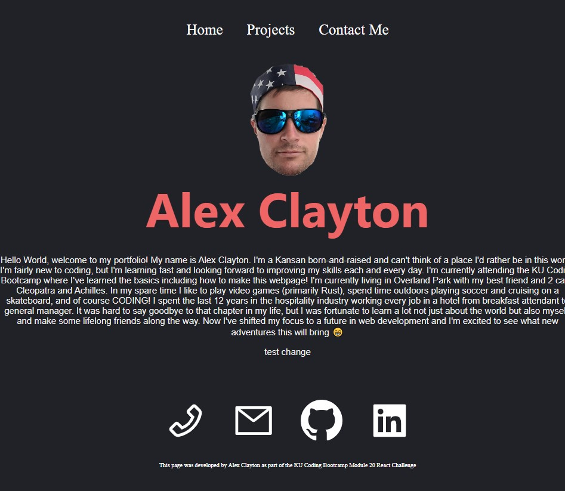

# Alex Clayton's React Portfolio

## Introduction
This project was developed by Alex Clayton as part of the KU Coding Bootcamp 20-React Challenge.  This is a refactor/remake of our portfolio project from week 2 of the KU Coding Bootcamp.

## What's in the project?
The acceptance criteria for this project are as follows:

1.  WHEN I load the portfolio
    THEN I am presented with a page containing a header, a section for content, and a footer

    This is present at page load, however The section for content does not render any of my components or pages until one of the links in the header navbar is clicked...

2.  WHEN I view the header
    THEN I am presented with the developer's name and navigation with titles corresponding to different sections of the portfolio

    The header contains a navbar with links to different pages containing separate content.

3.  WHEN I view the navigation titles
    THEN I am presented with the titles About Me, Portfolio, Contact, and Resume, and the title corresponding to the current section is highlighted

    About Me is reached by the Home Link.  The portfolio is contained in the Projects link.  Contact info is in the contact link.  I have yet to add a resume...

4.  WHEN I click on a navigation title
    THEN I am presented with the corresponding section below the navigation without the page reloading and that title is highlighted

    This is not present in the portfolio.  Instead, I used different pages reached after a page reload.

5.  WHEN I load the portfolio the first time
    THEN the About Me title and section are selected by default

    I couldn't figure this one out at first submission...  I think it's an issue with the homepage I specified in the package.json...?

6.  WHEN I am presented with the About Me section
    THEN I see a recent photo or avatar of the developer and a short bio about them

    Both are present in the Home section.

7.  WHEN I am presented with the Portfolio section
    THEN I see titled images of six of the developer’s applications with links to both the deployed applications and the corresponding GitHub repositories

    I only included 5 projects here as of the first submission, each displayed as an individual card.  Clicking each card takes the user to a page specific to the project with a link to the project as well as the github repository associated with the project.

8.  WHEN I am presented with the Contact section
    THEN I see a contact form with fields for a name, an email address, and a message

    I included my phone number and email with details about each contact method.

9.  WHEN I move my cursor out of one of the form fields without entering text
    THEN I receive a notification that this field is required

10. WHEN I move my cursor out of one of the form fields without entering text
    THEN I receive a notification that this field is required
11. WHEN I enter text into the email address field
    THEN I receive a notification if I have entered an invalid email address
12. WHEN I am presented with the Resume section
    THEN I see a link to a downloadable resume and a list of the developer’s proficiencies

    10, 11, and 12 are not present as of the first submission of this assignment.

13. WHEN I view the footer
    THEN I am presented with text or icon links to the developer’s GitHub and LinkedIn profiles, and their profile on a third platform (Stack Overflow, Twitter)

    I included phone, email, github, and linkedin here.  I have yet to create a stack overflow account, and prefer to maintain anonymity on Twitter.  As this is my first submission, I did not include a third social media, but future development should include a stack overflow or maybe a MySpace if I'm feeling spicy...

## The completed project resembles the following image when deployed:

Full Size desktop view

<!-- 
Installed the ES7+ React/Redux/React-Native snippets extension for VSCode.  Enables a quick autofill for react snippets.  Seems pretty useful. Generates a react component when typing rfce+tab in the file.
-->

<!-- 
Cannot import AiOutlineMenu from react-icons/ai or BsLinkedIn from react-icons/bs... 
-->